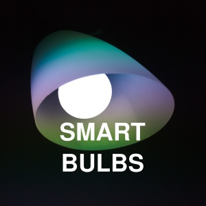

<!--more-->

#### Jump to:

* [Menu](#menu)

Over the past year, I delved into one of my emerging interests—home automation—to see how it could improve daily life with the current technology.  The devices I previously owned—a voice assistant speaker, a Wi-Fi plug, some inexpensive cameras—were completely underwhelming to use, but I could see the potential. Maybe with a sizable investment, I could build a real smart home.

After fitting three homes with an array of sensors, tablets, speakers, lights and other gadgets, I have to admit that the small conveniences gained with home automation add up to something meaningful. I can listen to my music synchronized in every room in the house, cast a Youtube video from my phone to the TV while the mood lighting automatically kicks in, and control all my devices from a tablet. When it works, the house truly feels integrated and I feel at peace and can enjoy living in a cool space. 

__Not everything is perfect, but the solution I have is good enough to recommend for beginners.__ What you will find here is a collection of unbiased advice and recommendations on each aspect of the smart home, and an honest opinion on what smart homes are capable of with today’s technology.

##  Who is the audience here?

  

    
  

  

    

      <h3>A DIY Skill Level</h3>
    

    

      
Not everyone aspires to be an electrician, and neither do I. My product recommendations are for do-it-yourself hobbyists with no professional experience in electrical work, but want to learn. To give an example of skill level needed, I can mount a TV on the wall but I would not run an electrical wire through the wall without an electrician’s help.

    

  

  

    
  

  

    

      <h3>A Reasonable Budget</h3>
    

    

      
I look for the best value within a reasonable price, so premium dealers like Control4 are out of the question. I favor reliability over cheaper prices, especially if it means saving time and headaches. Starting with a budget of $1,000 is enough to cover the infrastructure purchases and a few aspects of the smart home. $3,000 should be enough to cover everything except extravagant items like the Google Home Max, Homepods, and iPads. 

    

  

  

    
  

  

    

      <h3>A simple setup, unless there is a feature I need</h3>
    

    

      
I value my time and sanity, so I stuck with easy-to-setup consumer products like those from Google and Nest. There are cons to using cloud-dependent products, but I haven’t found any comparable products that are easy to setup and access remotely. I also wanted a nice user interface to highlight the smart home capabilities, so I set up a [Home Assistant](https://www.home-assistant.io/) instance to serve as a dashboard. Man, what a time sink it turned out to be, but Home Assistant is arguably the coolest part of my smart home. 

    

  

  

    
  

  

    

      <h3>Music at my convenience</h3>
    

    

      
I wanted a way to enjoy my digitized music collection (over 200 CDs!) and stream music throughout the house — and I’m happy to report that this is easily achievable with Chromecast Built-in speakers and the multi-room audio feature. Using smart speakers meant sacrificing audio fidelity, but that was my only choice in order to stay within budget. It’s been really nostalgic to rediscover old favorite songs from the past two decades back. I love it! 

    

  

## How easy was it to set up everything?

It wasn’t easy integrating products made by so many different vendors, but the process is much more doable today than it was  years ago. The problem with technology is that it advances so quickly, and it is inevitable that some products are no longer be supported. 

If you worry about it, you will never start building your smart home, so don’t worry about it!

  

    

<h2>Infrastructure</h2>

    
<a href="/infrastructure/network">

      

        
      

    

</a>

    
<a href="/infrastructure/home_automation_hub">

      

        
      

    

</a>

    
<a href="/infrastructure/wireless_standard">

      

        
      

    

</a>

    
<a href="/infrastructure/voice_assistant">

      

        
      

    

</a>
    

    

<h2>Media</h2>

        
<a href="/media/multiroom-audio">

      

        
      

    

</a>

    
<a href="/media/home-theater">

      

        
      

    

</a>

    
<a href="/media/media-streaming">

      

        
      

    

</a>

    
    

<h2>Smart Home Gadgets</h2>

        
<a href="/gadgets/smart-display">

      

        
      

    

</a>

    
<a href="/gadgets/tablet">

      

        
      

    

</a>

    
<a href="/gadgets/garage-door">

      

        
      

    

</a>

    
    

<h2>Security</h2>

        
<a href="/security/camera">

      

        
      

    

</a>

    
<a href="/security/security-system">

      

        
      

    

</a>

    
<a href="/security/sensor">

      

        
      

    

</a>

    
<a href="/security/smart-lock">

      

        
      

    

</a>

    

<h2>Lighting</h2>

        
<a href="/lighting/simple-lighting">

      

        
      

    

</a>

    
<a href="/lighting/smart-bulb">

      

        
      

    

</a>

    
<a href="/lighting/smart-switch">

      

        
      

    

</a>

    
<a href="/lighting/smart-switch">

      

        
      

    

</a>

  
  

